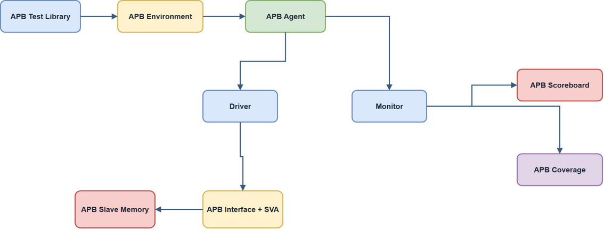

# AMBA APB UVM Verification Portfolio

[](https://accellera.org/downloads/standards/uvm)
[](https://developer.arm.com/documentation/ihi0024/c/)

UVM-based verification environment for an AMBA APB slave memory. The project demonstrates agent construction, monitor-to-scoreboard checking, protocol assertions, a connected functional coverage collector, and archived simulation evidence.

## Recruiter Quick View

| Evidence | Link |
|---|---|
| RTL DUT | [`rtl/apb_ram.sv`](./rtl/apb_ram.sv) |
| UVM environment | [`tb/uvm`](./tb/uvm) |
| Protocol interface + SVA | [`tb/uvm/apb_if.sv`](./tb/uvm/apb_if.sv) |
| Verification plan | [`docs/vplan.md`](./docs/vplan.md) |
| Regression summary | [`docs/regression_summary.md`](./docs/regression_summary.md) |
| Coverage summary | [`docs/coverage_report.txt`](./docs/coverage_report.txt) |
| Simulation log | [`sim_results/simulation.log`](./sim_results/simulation.log) |
| Waveform | [`docs/waveform.png`](./docs/waveform.png) |
| Waveform walkthrough | [`docs/apb_waveform_walkthrough.md`](./docs/apb_waveform_walkthrough.md) |
| Reset/wait-state plan | [`docs/reset_wait_state_plan.md`](./docs/reset_wait_state_plan.md) |
| Evidence policy | [`docs/evidence_policy.md`](./docs/evidence_policy.md) |

## Waveform Preview


## Implemented Features

| Component | Status | Description |
|---|---|---|
| UVM Agent | Implemented | Sequencer, driver, monitor, and APB transaction model |
| Interface/SVA | Implemented | APB setup/access timing and protocol checks |
| Scoreboard | Implemented | Golden reference memory with match/mismatch reporting |
| Functional Coverage | Implemented | Coverage collector connected to monitor analysis port |
| Test Library | Implemented | Base, random, invalid-boundary, and back-to-back test classes |

## Verification Matrix

| Test ID | Objective | Stimulus Type | Success Criteria |
|---|---|---|---|
| `apb_base_test` | Verify directed single write/read cycles | Directed | no SVA errors, scoreboard match |
| `apb_random_test` | Stress legal memory space observations | Constrained random | no scoreboard mismatches |
| `apb_error_test` | Exercise invalid boundary behavior | Targeted invalid access | `PSLVERR`/error evidence observed |
| `apb_b2b_test` | Check back-to-back transfer timing | Directed burst-like loop | correct setup/access sequencing |

## Evidence Policy

- Coverage model source is included and connected; numerical closure must be regenerated from a simulator coverage database before being claimed.
- GitHub Actions is an honest lint-only smoke path because Icarus Verilog does not provide a full UVM library.
- Full UVM simulation is intended for VCS, Xcelium, or Questa.

## Run Commands

```bash
# Full UVM examples
make simulate COMPILER=vcs TEST=apb_random_test
make simulate COMPILER=xcelium TEST=apb_error_test

# Lint-only CI/smoke path
make lint COMPILER=iverilog
```

For a multi-test command template, see [`scripts/run_regression.ps1`](./scripts/run_regression.ps1).

## Architecture



Editable source: [`docs/apb_uvm_architecture.drawio`](docs/apb_uvm_architecture.drawio).

## Roadmap

- APB4 `PPROT`/`PSTRB` checking.
- Register model / RAL-style mirror.
- Integration into a combined AXI4-Lite-to-APB platform.
