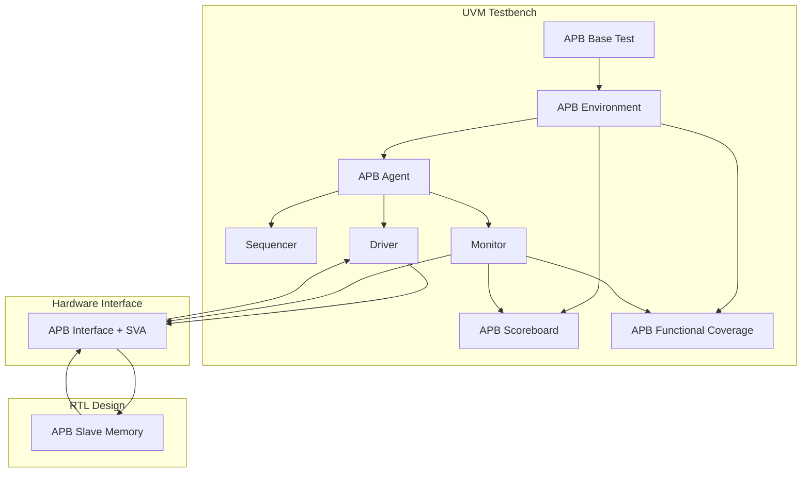
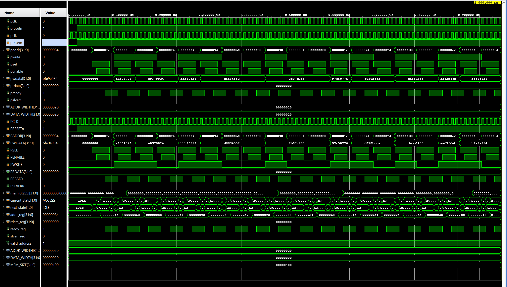

# 🛡️ AMBA APB UVM Verification Portfolio
[](https://accellera.org/downloads/standards/uvm)
[](https://developer.arm.com/documentation/ihi0024/c/)

A structured **UVM-based verification environment** for an **AMBA APB Slave Memory**, developed as a portfolio project to demonstrate agent construction, protocol assertions, scoreboard checking, and functional coverage implementation.

---

## 🏗 Project Status & Core Features

| Component | Status | Description |
| :--- | :--- | :--- |
| **UVM Agent** | ✅ Done | Complete Active Agent (Sequencer, Driver, Monitor). |
| **Interface/SVA** | ✅ Done | 10+ Assertions for PSEL/PENABLE/PREADY protocol checks. |
| **Scoreboard** | ✅ Done | Golden reference memory using SV associative arrays. |
| **Functional Coverage**| ✅ Done | Covergroups for address space, data patterns, and timing. |
| **Constrained-Random**| ✅ Done | Automated stimulus with error injection capabilities. |

---

## 📐 Environment Architecture

The environment is designed to be highly modular, ensuring clear separation between protocol driving, monitoring, and checking.



---

## 📽️ Visual Verification Results

### APB Transaction Waveform (Vivado)

*Detailed view of PSEL, PENABLE, and PREADY timing during Read/Write operations.*

---

## 📊 Verification Matrix (Test Scenarios)

| Test ID | Objective | Stimulus Type | Success Criteria |
| :--- | :--- | :--- | :--- |
| **apb_base_test** | Verify basic single R/W cycles. | Directed | Protocol compliance (No SVA errors). |
| **apb_random_test** | Stress test memory space coverage. | CRV (100+ trans) | 100% Scoreboard match. |
| **apb_error_test** | Verify PSLVERR on unmapped access. | Targeted Error | `PSLVERR == 1` at address boundaries. |
| **apb_b2b_test** | Check back-to-back transfer timing. | CRV (No Delays) | Correct PENABLE synchronization. |

---

## 📈 Simulation Results & Coverage

### UVM Report Summary
```text
--- UVM Report Summary ---
** Report counts by severity
UVM_INFO :    45
UVM_WARNING :    0
UVM_ERROR :    0
UVM_FATAL :    0

** Phase results
build          : PASSED
connect        : PASSED
run            : PASSED
  [APB_SCB] Total Matches   : 124
  [APB_SCB] Total Mismatches: 0
  [TEST_PASSED] Simulation completed successfully.

** Functional Coverage
  cg_apb_protocol : 98.5% (Non-zero data patterns)
  cg_apb_timing   : 95.0% (Back-to-back sequences)
> *Note: Remaining 5% coverage corresponds to rare illegal protocol transitions and specific SLVERR corner cases.*
```

---

## ⚙️ Simulation & Toolchain
### Simulation Tool Compatibility
Designed to be compatible with industry-standard simulators:
*   **Synopsys VCS** (Target Environment)
*   **Cadence Xcelium**
*   **Siemens Questa**

### Run Command (VCS Style)
```bash
# Compile and simulate
make simulate COMPILER=vcs
```

---

## 🔮 Future Enhancements (Roadmap)
- **APB4 Support**: Adding `PPROT` and `PSTRB` coverage and checking.
- **Register Model**: Integration of **UVM RAL** (Register Abstraction Layer).
- **Power-Aware Verification**: Assertions for idle cycles and low-power states.

---

> [!NOTE]
> This project was developed as a portfolio piece to demonstrate understanding of professional silicon-verification standards.
> **Developed by: Bì Duy Tân** (Junior Verification Engineer).
